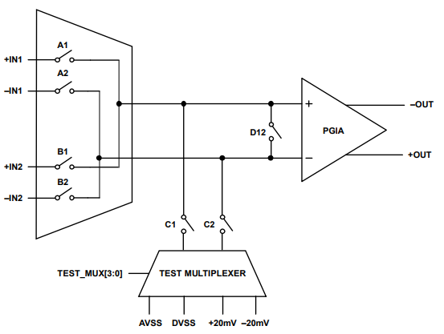
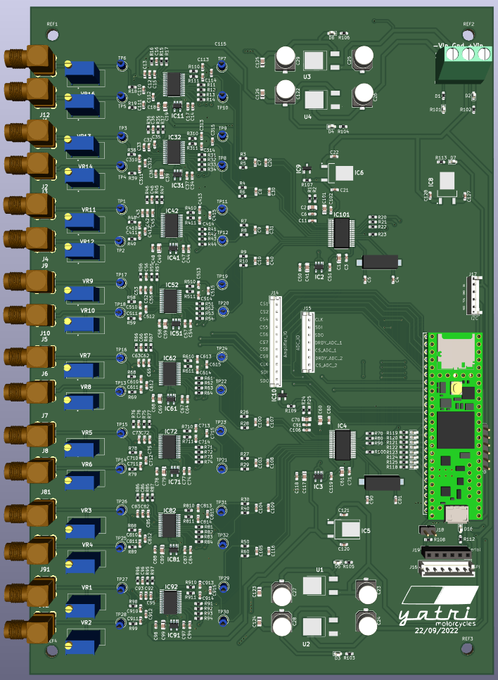

# ADA4254 library

## 1 ADA4254.h file
    enum gain defines the gain settings
    class ada4254 is used to define spi settings cs pins and callibration mode

### 1.1 Function defination
|functions              |          function                                     | Variables                         |Register|
| --------------------- | ----------------------------------------------------- | --------------------------------- |--------|
|connectInputA();       |Connects input a to the amplifier                      |connects +IN1 and -IN1 to the PGA  |0x06    |
|connectInputB();       |Connects input B to the amplifier                      |connects +IN2 and -IN2 to the PGA  |0x06    |
|connectInputDVSS();    |Connects the DVSS to the PGA input termainal           |connects DVSS to both PGA terminals|0x0E    |
|connectInputP20mv();   |Connects +20 mv to the IN+ of the PGA                  |Suplies +20 mv to PGA terminals    |0x0E    |
|connectInputM20mv();   |Connects -20 mv to the IN- of the PGA                  |Suplies -20 mv to PGA terminals    |0x0E    |
|disconnectInputs();    |disconnects all inputs to the amplifier                |                                   |0x06    |
|setGain(GAIN val);     |Used to select predefined gains for the amplifier      |sets gain according to table 1.1.2 |0x00    |
|available();           |reads 0x2f register and expects return value to 0x30   |                                   |0x2F    |
|init();                |initialize the amplifier                               |                                   |0x0B    |
|isError();             |checks for errors in the giver registers               |                                   |        |
|getAnalogError();      |returns analog error                                   |                                   |0x04    |
|getDigitralError();    |returns digital error                                  |                                   |0x03    |
|clearError();          |                                                       |                                   |0x3B    |
|isBusy();              |                                                       |                                   |0x40    |
|calibration();         |sets 0x2A to 0x01 that initiates callibration sequance |                                   |0x2A    |

### 1.2 Calling order
- Initialize 
    - Call the init function. Calling this function will set Bit 0 of 0x01 register high. Setting this bit high will reset all internal registers and set them to their default value.

- callibrate
    - calling calibration function will set 0x2A to 0x01 that initiates callibsration sequance. type of callibration depends upon the CAL_SEL and CAL_EN bits of the register 0x0E.
      Clearing CAL_SEL bits to 0 will configure ADA4254 to perform quick callibration, setting amplifier will perform full callibartion if this bit is set to 1. We can also define 
      in what interval should the amplifier callibrate itself. setting CAL_EN to 00 will disable the scheduled callibration configuration, 01,10 and 11 will enable the sechduled callibration interval to 33,132 and 495 seconds interval respectively. 
    - CAL_EN enables scheduled calibrations and configures the interval on which these calibrations execute. 
      interval on which these calibrations execute. While calibrations are executing, the inputs of the PGIA are not connected to the input pins. The CAL_BUSY signal indicates when a
      calibration is executing. CAL_BUSY can be output to GPIO2 by configuring GPIO2 as an output via GPIO_DIR and setting CAL_BUSY_OUT to 1. Minimize and avoid noise and input transients during calibrations. 

- Connect input
    - Calling connectInputA() will connect IN1+ and IN1- to PGA inputs
    - Calling connectInputB() will connect IN2+ and IN2- to PGA inputs
    - Calling connectInputDVSS() will connect DVSS to both PGA inputs
    - Calling connectInputP20mv() will supply +20 mv to PGA input terminals
    - Calling connectInputN20mv() will supply -20 mv to PGA input terminals
    - Calling disconnectInputs() will disconnect all inputs from PGA input termainals

    

- set gain
    - calling setGain() function will sets the PGA gain to the respective gain. The gain values that can be passed to the setGain function can be seen on enum on header file.

#### 1.1.1 Test mux (Register 0x0E)
|Test_mux[3:0]|Noninverting Input|Inverting Input|
|-------------|------------------|---------------|
|0000         |AVSS              |AVSS           |
|0001         |DVSS              |AVSS           |
|0100         |AVSS              |DVSS           |
|0101         |DVSS              |DVSS           |
|1010         |+20 mv                            |
|1111         |-20 mv                            |

#### 1.1.2 Gain setting (Register:0x06)
|amp gain     |G3       |G2      |G1       |G0      |
|-------------|---------|--------|---------|--------|
|1/16         |0        |0       |0        |0       |
|1/8          |0        |0       |0        |1       |
|1/4          |0        |0       |1        |0       |
|1/2          |0        |0       |1        |1       |
|1            |0        |1       |0        |0       |
|2            |0        |1       |0        |1       |
|4            |0        |1       |1        |0       |
|8            |0        |1       |1        |1       |
|16           |1        |0       |0        |0       |
|32           |1        |0       |0        |1       |
|64           |1        |0       |1        |0       |
|128          |1        |0       |1        |1       |

## 2 PCB board

    

